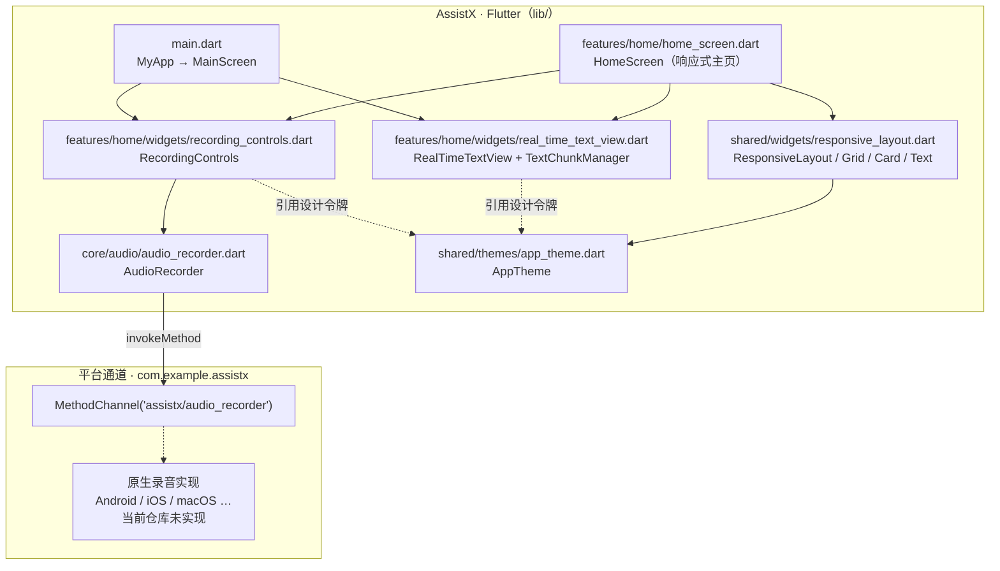
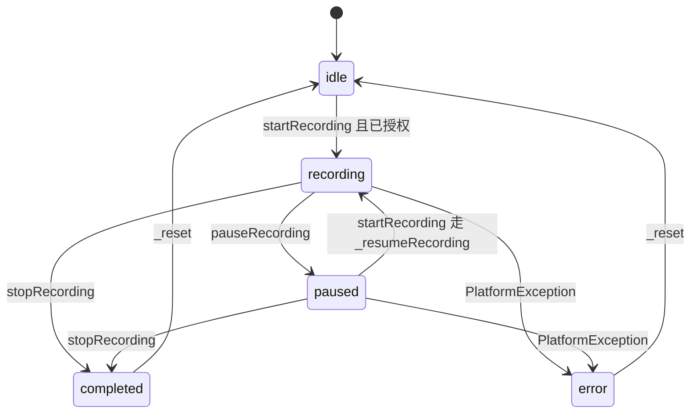
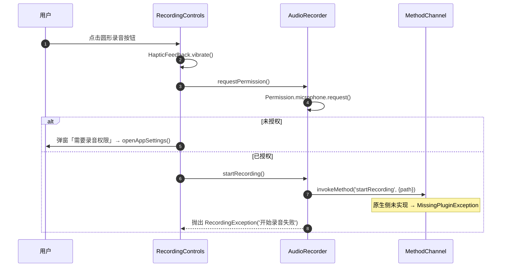
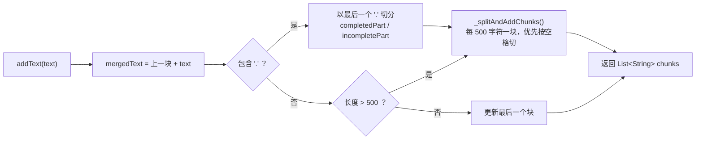
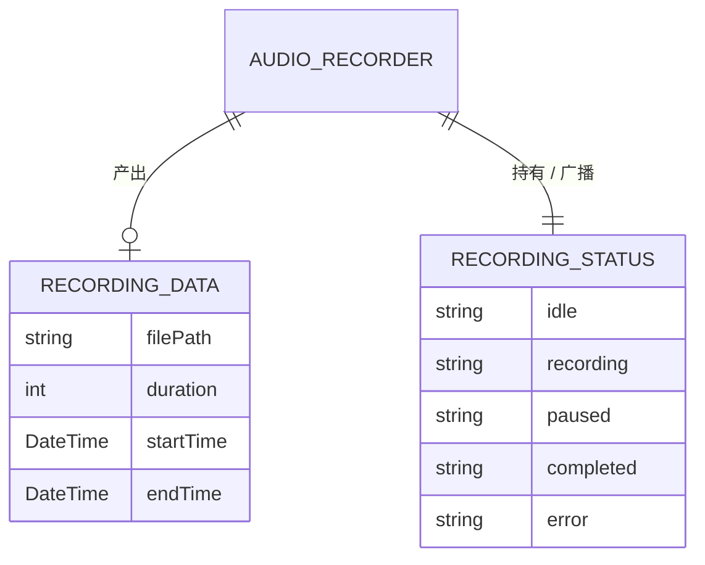

<div align="center">

> [English](./README_en.md) | **简体中文**


# AssistX · 全天录音助手

**为「一整天都在听」而生的 Flutter 录音应用底座 —— 录音状态机、实时文本分块渲染、手机 / 平板响应式布局与深浅色设计系统。**


</div>

---

## 它解决什么问题

长时间录音（会议、课堂、访谈、灵感速记）和普通「点一下录一段」是两种完全不同的场景：前者要停得下来也接得上去、要能在录音的同时把文字铺出来、要在几十分钟的持续输出下不把内存吃满、还要在手机和平板上都好看。

**AssistX 把这些关注点拆成一套清晰的 Flutter 应用底座：**

- **录音控制**：一次性把「开始 / 暂停 / 继续 / 停止」四态收敛进一个 `AudioRecorder`，状态用 `Stream` 广播，界面只订阅不猜测；
- **实时文本**：`TextChunkManager` 按句号和长度把流式文本切成小块，避免单条超长字符串拖垮渲染；
- **响应式**：以 **800px** 为断点，手机上下堆叠、平板左侧栏 + 主内容，一套代码两种形态；
- **设计系统**：颜色、间距、圆角、字号、动画时长全部收敛到 `AppTheme`，深浅色同源。

> **项目状态（务必先读）**：本仓库是一次 `first commit` 的**进行中**项目。Flutter 侧的录音状态机、UI、设计系统与文本分块已实现；**原生录音通道（`assistx/audio_recorder`）与语音转写引擎尚未接入**——详见下文「注意事项」，避免踩坑。

---

## ✨ 功能

- 🎛️ **四态录音状态机** —— `idle → recording ⇄ paused → completed`，`RecordingStatus` 枚举 + `statusStream` 广播，暂停时长会被精确扣除。
- ⏯️ **暂停 / 继续**：`AudioRecorder.pauseRecording()` 与恢复逻辑记录 `_pauseStartTime` / `_totalPauseDuration`，最终时长 = 总时长 − 累计暂停时长。
- 📝 **实时文本分块**：`TextChunkManager` 以 **500 字符**为上限，优先在句号 `.` 处成句，其次在空格处断开，完整句子与进行中的句子用不同字重与颜色区分。
- 📱 **响应式双形态**：`ResponsiveLayout` 以 **800px** 为断点切换手机 / 平板布局；平板形态带 200px 侧边栏（主页 / 历史记录 / 设置 / 关于）。
- 🎨 **统一设计系统**：`AppTheme` 提供浅色 / 深色 `ColorScheme`（主色 `#4F46E5`）、间距令牌、圆角令牌、字号阶梯与动画时长。
- 🔔 **交互反馈**：录音按钮 140px 圆形 + 脉冲动画（1.0 → 1.2）+ `HapticFeedback.vibrate()` 震动；权限被拒时弹窗引导 `openAppSettings()`。
- 🧱 **规划中的模块**（当前为占位空文件）：Riverpod 状态管理、设置页、语音模式选择、时间线、内存安全长列表 —— 见下文「目录结构」。

---

## 🚀 快速开始

### 方式一：面向 AI Agent（一键脚手架，推荐）

把下面这段提示词直接发给你的本地 AI Agent（Claude Code / Codex / OpenCode …）：

````markdown
请帮我搭建并运行 AssistX（GitHub: https://github.com/RayMorTwinkle/AssistX）。
背景：AssistX 是一个 Flutter 写的「全天录音助手」应用底座，包含录音状态机、实时文本分块与响应式设计系统。

环境：Flutter >= 3.24.0，Dart >= 3.9.2。

步骤：
1. 克隆：git clone https://github.com/RayMorTwinkle/AssistX.git && cd AssistX
2. 拉依赖：flutter pub get
3. 静态检查：flutter analyze（应无 error）
4. 运行：flutter run -d <你的设备>（也可 flutter devices 先列出设备）
5. 提示用户：当前仓库的 Android/iOS/macOS 原生侧**尚未实现** `assistx/audio_recorder`
   这个 MethodChannel，点击「开始录音」会提示操作失败；如需真正录音，请在原生侧实现该通道。
6. 向用户汇报运行结果与上述限制，不要假装录音已可用。
````

### 方式二：面向人类用户

```bash
git clone https://github.com/RayMorTwinkle/AssistX.git
cd AssistX
flutter pub get          # 拉取依赖
flutter analyze          # 静态检查
flutter run              # 选择设备运行
```

> **环境要求**：Flutter ≥ 3.24.0、Dart ≥ 3.9.2。依赖仅 `permission_handler ^11.0.0` 与 `cupertino_icons ^1.0.8`（另含开发依赖 `flutter_lints ^5.0.0`）。

---

## 🖥️ 使用

AssistX 是一个移动 / 桌面应用（非 CLI），交互集中在主页一屏：

| 界面元素 | 位置 | 行为 |
|---|---|---|
| 录音按钮（圆形 140px） | `RecordingControls` | `idle` 点击 → 请求麦克风权限并开始录音；`recording` 点击 → 暂停；`paused` 点击 → 继续 |
| 停止按钮 | `RecordingControls` | 仅在 `recording` / `paused` 时显示，调用 `stopRecording()` 并复位 |
| 录音时长 | `RecordingControls` / `MainScreen` | 每秒刷新 `mm:ss` |
| 实时转写区 | `RealTimeTextView` | 标题「实时转写结果」，按文本块渲染完整句 / 进行中句 |
| 平板侧边栏 | `HomeScreen`（≥800px） | 主页 / 历史记录 / 设置 / 关于 四个入口 |

**录音数据流**：`RecordingControls._toggleRecording()` → `AudioRecorder.startRecording()` → `MethodChannel('assistx/audio_recorder').invokeMethod('startRecording', {'path': ...})`。

> **当前限制**：原生侧未实现该通道，运行时 `invokeMethod` 会抛 `MissingPluginException`，被 `catch` 后提示「操作失败」。Flutter 侧状态机与 UI 流程本身是完整的。

---

## 🏗️ 架构

### 系统总览

Flutter 侧分为「入口 / 特性 UI / 核心音频 / 共享设计系统」四层，向下经一个方法通道对接平台原生录音（原生部分当前缺失）。



### 录音状态机

`RecordingStatus` 的五态与迁移条件（方法名与源码一致）：



### 录音时序（含权限）

以「开始录音」为例，展示权限请求到方法通道调用的完整链路（原生实现缺失处已如实标注）：



### 实时文本分块

`TextChunkManager.addText()` 的切分策略：先按最后一个句号切成「已完成 / 未完成」，再对完成部分按 500 字符、优先空格断行。



### 数据模型

`AudioRecorder` 产出 `RecordingData`，并以 `RecordingStatus` 对外广播状态。



---

## 📂 目录结构

```text
AssistX/
├── lib/
│   ├── main.dart                      # 入口：MyApp(MaterialApp) → MainScreen（录音主页）
│   ├── core/
│   │   └── audio/
│   │       └── audio_recorder.dart    # AudioRecorder：状态机 / 权限 / 方法通道
│   ├── features/
│   │   ├── home/
│   │   │   ├── home_screen.dart        # HomeScreen：带侧边栏的响应式主页
│   │   │   └── widgets/
│   │   │       ├── recording_controls.dart    # 圆形录音按钮 + 脉冲动画 + 震动
│   │   │       ├── real_time_text_view.dart   # 实时文本视图 + TextChunkManager
│   │   │       └── text_buffer_manager.dart   # 占位（0 字节）
│   │   ├── settings/                   # 占位：settings_screen / performance_settings / speech_mode_selector（均 0 字节）
│   │   └── timeline/                   # 占位：timeline_screen / _list / _item / _connector（均 0 字节）
│   ├── shared/
│   │   ├── themes/
│   │   │   ├── app_theme.dart          # AppTheme：颜色 / 间距 / 圆角 / 字号 / 动画
│   │   │   ├── colors.dart             # 占位（0 字节）
│   │   │   └── text_styles.dart        # 占位（0 字节）
│   │   ├── utils/                      # 占位：constants / debouncer / helpers（均 0 字节）
│   │   └── widgets/
│   │       ├── responsive_layout.dart  # ResponsiveLayout / Grid / Row / Card / Text / Padding
│   │       ├── animated_text_chunk.dart      # 占位（0 字节）
│   │       ├── memory_safe_list_view.dart    # 占位（0 字节）
│   │       └── vibration_feedback.dart       # 占位（0 字节）
│   └── state/                          # 占位：app_state / recording_provider / settings_provider（均 0 字节）
├── android/ ios/ macos/ linux/ windows/ web/   # Flutter 六平台脚手架
├── assets/logo.svg                     # 应用图标（本仓库重制）
├── .trae/rules/project_rules.md        # 项目开发规范（性能 / 结构 / UI / 内存 / 错误处理）
├── pubspec.yaml                        # 依赖与元信息
└── test/widget_test.dart               # 仍是 Flutter 计数器模板（见注意事项）
```

---

## 🔧 技术细节

**方法通道契约。** Flutter 侧只认一个通道：`MethodChannel('assistx/audio_recorder')`，四个方法分别是 `startRecording`（参数 `{'path': filePath}`）、`pauseRecording`、`resumeRecording`、`stopRecording`。录音文件名格式为 `recording_<millisecondsSinceEpoch>.aac`。

**暂停时长会在 Dart 侧扣除。** 计时器每 **100ms** 更新 `_duration`；`_startTimer()` 计算 `now - _startTime - _totalPauseDuration`。暂停时记录 `_pauseStartTime`，恢复或停止时累加进 `_totalPauseDuration`，因此暂停期间不计入最终时长。

**状态用广播流暴露。** `AudioRecorder` 内部维护 `StreamController.broadcast()`，`statusStream` 对外；`_setStatus()` 会同时更新字段并 `add`。`dispose()` 关闭计时器与流。

**权限处理。** 通过 `permission_handler` 的 `Permission.microphone.status / request()`；`RecordingControls` 在权限被拒时弹窗并提供 `openAppSettings()` 跳转。

**设计令牌。** `AppTheme.breakpoint = 800`；浅色主色 `primary = #4F46E5`、次色 `secondary = #10B981`、错误色 `error = #EF4444`；深色主色 `#818CF8`。间距 `paddingXS…XL`（4/8/16/24/32），圆角 `radiusS…XL`（4/8/16/24），动画时长 `animationFast/Medium/Slow`（150/300/500ms）。`isLargeScreen()` 与 `getResponsiveWidth()` 是响应式判断的两个基元。

**文本分块参数。** `TextChunkManager.maxChunkSize = 500`；`isCompleteSentence(chunk)` 以是否以 `.` 结尾判定完整句；`_splitAndAddChunks()` 在切分点前用 `lastIndexOf(' ')` 找空格，尽量避免切断单词；`getTextLength()` 汇总总长度用于内存监控。

**跨平台脚手架齐备但配置不全。** Android 侧 `AndroidManifest.xml` 已声明 `android.permission.RECORD_AUDIO`；iOS `Info.plist` **缺少** `NSMicrophoneUsageDescription`；macOS entitlements 仅有 `app-sandbox`，**缺少** `com.apple.security.device.audio-input`。这些都需要在真正接入原生录音时补齐。

**开发规范。** `.trae/rules/project_rules.md` 约定了：所有 `StatelessWidget` 用 `const` 构造、`ListView.builder` + `itemExtent`、单文件 ≤ 300 行、状态管理用 Riverpod（`*Provider` 命名）、颜色尺寸引自 `app_theme.dart`。这些是**目标约束**，与仓库中大量 `state/` 占位文件相互印证。

---

## ❓ 常见问题

**Q：点了「开始录音」提示操作失败？**
A：这是**预期现象**。Dart 侧会 `invokeMethod('startRecording')`，但本仓库的原生 Android / iOS / macOS 侧**没有实现** `assistx/audio_recorder` 通道，于是抛 `MissingPluginException`，被捕获后提示「操作失败」。要真正录音，需先实现平台侧该通道（或改用 `record` 等插件，但当前 `pubspec.yaml` 未引入）。

**Q：转写区一直显示「开始录音后，文本将在此处显示」？**
A：因为**语音转写（ASR）引擎尚未接入**。`RealTimeTextView` 已具备分块渲染能力，但 `_textChunks` 目前没有任何数据源写入，`_isRecording` 也是常量 `false`。这是 UI 骨架，不是可用的转写。

**Q：为什么仓库里有那么多 0 字节的 `.dart` 文件？**
A：它们是**规划中模块的占位符**（`state/`、`settings/`、`timeline/`、若干 `shared/` 组件）。详见目录结构中的「占位」标注。它们不参与编译为有效功能。

**Q：支持哪些平台？**
A：`android / ios / macos / linux / windows / web` 六平台脚手架齐全，但录音能力依赖各平台原生实现，当前均未接入。

**Q：`flutter test` 能过吗？**
A：不能。`test/widget_test.dart` 仍是 Flutter 新建工程自带的计数器模板（查找 `Icons.add` 并断言计数），与 `MyApp` 的实际 UI 不符；运行时该测试会失败。README 如实标注，未修改源码。

---

## ⚠️ 注意事项

- **原生录音通道未实现**：Flutter 侧的 `AudioRecorder` 仅封装了方法调用，平台侧 `assistx/audio_recorder` 通道不存在，实际录音不可用。
- **转写 / 时间线 / 设置尚未实现**：相关文件为空占位，README 不将其描述为已具备功能。
- **权限配置不完整**：iOS 缺 `NSMicrophoneUsageDescription`；macOS 缺 `com.apple.security.device.audio-input`。即使实现了原生通道，也需要补齐这些键。
- **测试为过期模板**：`widget_test.dart` 与当前 UI 不匹配，属已知遗留。
- **本项目为 `first commit` 的进行中状态**，接口与目录结构可能随开发调整。

---

## 📄 License

本仓库当前**未附带开源许可证文件**。若需对外分发或允许他人使用，建议补充一个许可证（如 MIT）。在此之前，默认保留所有权利。

---

## 🙏 致谢 / Credits

- 基于 [Flutter](https://flutter.dev/) 与 [Material Design](https://m3.material.io/) 构建。
- 麦克风权限依赖社区包 [permission_handler](https://pub.dev/packages/permission_handler)。
- 本仓库的图标（`assets/logo.svg`）、README（中英双语）与架构图为本项目重制。

---

<div align="center">
<sub>AssistX · 让「一整天都在听」这件事，有一个稳的底座</sub>
</div>
