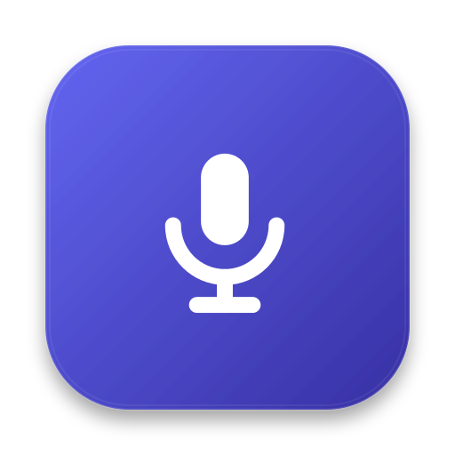
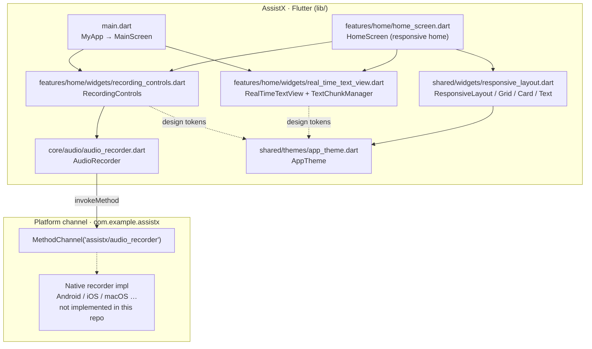
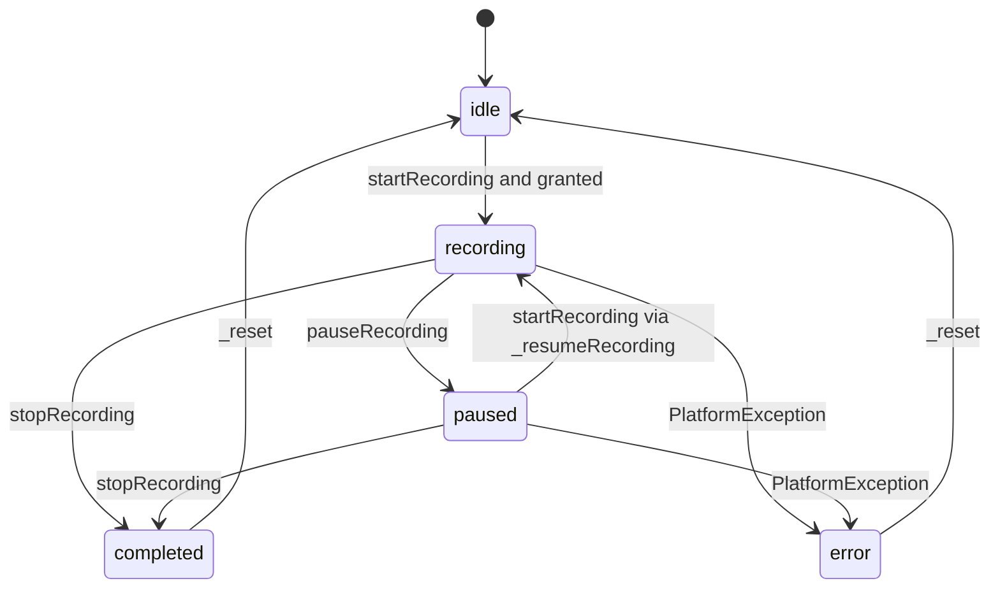
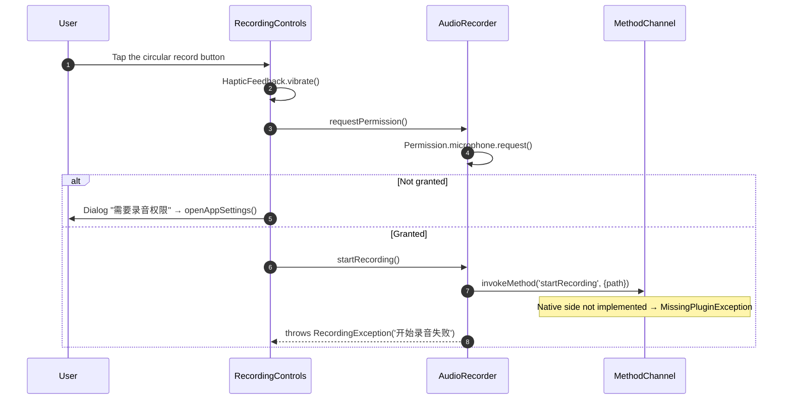
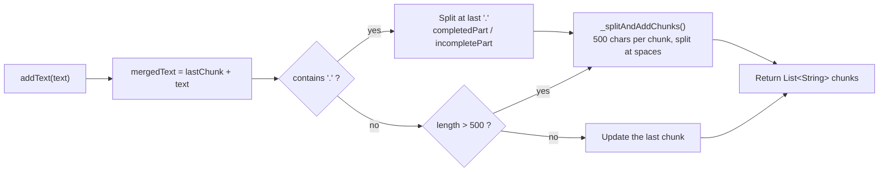
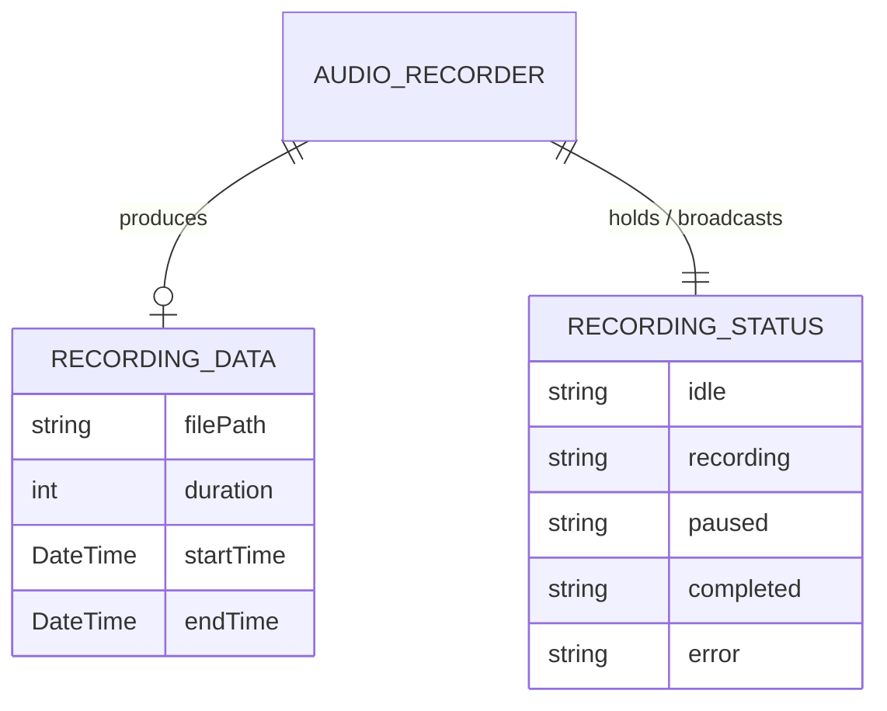

<div align="center">

> **English** | [简体中文](./README.md)



# AssistX · All-Day Recording Assistant

**A Flutter foundation built for "listening all day long" — a recording state machine, chunked real-time text rendering, phone / tablet responsive layouts, and a light/dark design system.**


</div>

---

## Why it exists

Recording for hours (meetings, lectures, interviews, quick notes) is a very different problem from "tap once, record a clip". Long sessions must be pausable and resumable, must surface text while audio is still being captured, must not blow up memory after tens of minutes of streaming output, and must look right on both phones and tablets.

**AssistX breaks these concerns into a clear Flutter foundation:**

- **Recording control** — collapses "start / pause / resume / stop" into a single `AudioRecorder`, broadcasting state through a `Stream` so the UI subscribes instead of guessing.
- **Real-time text** — `TextChunkManager` splits streaming text into small chunks by sentence boundary and length, so one over-long string never drags rendering down.
- **Responsive layouts** — a **800px** breakpoint: stacked on phones, sidebar + main content on tablets, one codebase with two shapes.
- **Design system** — colors, spacing, radii, type scale, and animation durations all funnel through `AppTheme`, shared by light and dark modes.

> **Project status (read first)** — this repo is a **work-in-progress** at its `first commit`. The Flutter-side recording state machine, UI, design system, and text chunking are implemented; the **native recording channel (`assistx/audio_recorder`) and the speech-to-text engine are not wired up yet** — see "Notes" below before you trip over it.

---

## ✨ Features

- 🎛️ **Four-state recording machine** — `idle → recording ⇄ paused → completed`, exposed via the `RecordingStatus` enum and a `statusStream`; paused time is subtracted precisely.
- ⏯️ **Pause / resume** — `AudioRecorder.pauseRecording()` and the resume path track `_pauseStartTime` / `_totalPauseDuration`, so final duration = elapsed − total paused time.
- 📝 **Chunked real-time text** — `TextChunkManager` caps chunks at **500 chars**, prefers splitting at a period `.`, then at a space; complete vs. in-progress sentences get different weight and color.
- 📱 **Two responsive shapes** — `ResponsiveLayout` switches at a **800px** breakpoint; the tablet shape has a 200px sidebar (Home / History / Settings / About).
- 🎨 **Unified design system** — `AppTheme` provides light/dark `ColorScheme` (primary `#4F46E5`), spacing tokens, radii, a type scale, and animation durations.
- 🔔 **Interaction feedback** — a 140px circular record button with a pulse animation (1.0 → 1.2) plus `HapticFeedback.vibrate()`; on denied permission, a dialog guides users to `openAppSettings()`.
- 🧱 **Planned modules** (currently empty placeholders) — Riverpod state management, settings screen, speech-mode selector, timeline, memory-safe long lists — see "Project layout" below.

---

## 🚀 Quick Start

### Option 1 — For AI agents (one-shot scaffold, recommended)

Paste this prompt into your local AI agent (Claude Code / Codex / OpenCode …):

````markdown
Please set up and run AssistX (GitHub: https://github.com/RayMorTwinkle/AssistX).
Context: AssistX is a Flutter foundation for an "all-day recording assistant", with a
recording state machine, chunked real-time text, and a responsive design system.

Requirements: Flutter >= 3.24.0, Dart >= 3.9.2.

Steps:
1. Clone: git clone https://github.com/RayMorTwinkle/AssistX.git && cd AssistX
2. Fetch deps: flutter pub get
3. Static check: flutter analyze (should report no errors)
4. Run: flutter run -d <your device> (use `flutter devices` to list devices)
5. Warn the user: the native Android/iOS/macOS side does NOT yet implement the
   `assistx/audio_recorder` MethodChannel, so tapping "start recording" fails. Real
   recording requires implementing that channel natively.
6. Report the result plus the limitation above; do not pretend recording works.
````

### Option 2 — For humans

```bash
git clone https://github.com/RayMorTwinkle/AssistX.git
cd AssistX
flutter pub get          # fetch dependencies
flutter analyze          # static analysis
flutter run              # pick a device and run
```

> **Requirements**: Flutter ≥ 3.24.0, Dart ≥ 3.9.2. The only runtime dependencies are `permission_handler ^11.0.0` and `cupertino_icons ^1.0.8` (plus the dev dependency `flutter_lints ^5.0.0`).

---

## 🖥️ Usage

AssistX is a mobile / desktop app (not a CLI); the interaction lives on a single home screen:

| UI element | Location | Behavior |
|---|---|---|
| Record button (140px circle) | `RecordingControls` | `idle` → request mic permission and start; `recording` → pause; `paused` → resume |
| Stop button | `RecordingControls` | Shown only while `recording` / `paused`; calls `stopRecording()` and resets |
| Duration | `RecordingControls` / `MainScreen` | Refreshes `mm:ss` every second |
| Real-time text area | `RealTimeTextView` | Titled "实时转写结果"; renders complete / in-progress chunks |
| Tablet sidebar | `HomeScreen` (≥800px) | Four entries: Home / History / Settings / About |

**Recording data flow**: `RecordingControls._toggleRecording()` → `AudioRecorder.startRecording()` → `MethodChannel('assistx/audio_recorder').invokeMethod('startRecording', {'path': ...})`.

> **Current limitation**: the native side does not implement this channel, so `invokeMethod` throws `MissingPluginException` at runtime, is caught, and surfaces as "操作失败". The Flutter-side state machine and UI flow themselves are complete.

---

## 🏗️ Architecture

### System overview

The Flutter side has four layers — entry / feature UI / core audio / shared design system — connecting downward through one method channel to native recording (currently missing).



### Recording state machine

The five `RecordingStatus` states and their transition conditions (method names match the source):



### Recording sequence (with permissions)

Taking "start recording" as the example, from permission request to method-channel call (missing native pieces are labeled honestly):



### Real-time text chunking

`TextChunkManager.addText()`: first split at the last period into "completed / incomplete", then break the completed part into **500-char** chunks, preferring spaces.



### Data model

`AudioRecorder` produces `RecordingData` and broadcasts `RecordingStatus`.



---

## 📂 Project layout

```text
AssistX/
├── lib/
│   ├── main.dart                      # Entry: MyApp(MaterialApp) → MainScreen (recording home)
│   ├── core/
│   │   └── audio/
│   │       └── audio_recorder.dart    # AudioRecorder: state machine / permission / channel
│   ├── features/
│   │   ├── home/
│   │   │   ├── home_screen.dart        # HomeScreen: responsive home with sidebar
│   │   │   └── widgets/
│   │   │       ├── recording_controls.dart    # Circular record button + pulse + haptics
│   │   │       ├── real_time_text_view.dart   # Real-time text view + TextChunkManager
│   │   │       └── text_buffer_manager.dart   # placeholder (0 bytes)
│   │   ├── settings/                   # placeholders: settings_screen / performance_settings / speech_mode_selector (all 0 bytes)
│   │   └── timeline/                   # placeholders: timeline_screen / _list / _item / _connector (all 0 bytes)
│   ├── shared/
│   │   ├── themes/
│   │   │   ├── app_theme.dart          # AppTheme: colors / spacing / radii / type / animation
│   │   │   ├── colors.dart             # placeholder (0 bytes)
│   │   │   └── text_styles.dart        # placeholder (0 bytes)
│   │   ├── utils/                      # placeholders: constants / debouncer / helpers (all 0 bytes)
│   │   └── widgets/
│   │       ├── responsive_layout.dart  # ResponsiveLayout / Grid / Row / Card / Text / Padding
│   │       ├── animated_text_chunk.dart      # placeholder (0 bytes)
│   │       ├── memory_safe_list_view.dart    # placeholder (0 bytes)
│   │       └── vibration_feedback.dart       # placeholder (0 bytes)
│   └── state/                          # placeholders: app_state / recording_provider / settings_provider (all 0 bytes)
├── android/ ios/ macos/ linux/ windows/ web/   # Flutter six-platform scaffold
├── assets/logo.svg                     # App icon (remade for this repo)
├── .trae/rules/project_rules.md        # Dev rules (perf / structure / UI / memory / errors)
├── pubspec.yaml                        # Dependencies and metadata
└── test/widget_test.dart               # Still the Flutter counter template (see Notes)
```

---

## 🔧 Technical notes

**The method-channel contract.** The Dart side knows exactly one channel — `MethodChannel('assistx/audio_recorder')` — with four methods: `startRecording` (argument `{'path': filePath}`), `pauseRecording`, `resumeRecording`, `stopRecording`. The output filename is `recording_<millisecondsSinceEpoch>.aac`.

**Paused time is tracked in Dart.** A timer updates `_duration` every **100ms**; `_startTimer()` computes `now - _startTime - _totalPauseDuration`. On pause it records `_pauseStartTime`; on resume or stop it accumulates into `_totalPauseDuration`, so paused time never counts toward the final duration.

**State is exposed as a broadcast stream.** `AudioRecorder` holds a `StreamController.broadcast()` and exposes `statusStream`; `_setStatus()` updates the field and `add`s to the stream together. `dispose()` closes both the timer and the stream.

**Permissions.** Handled with `permission_handler`'s `Permission.microphone.status / request()`; when denied, `RecordingControls` shows a dialog with an `openAppSettings()` shortcut.

**Design tokens.** `AppTheme.breakpoint = 800`; light `primary = #4F46E5`, `secondary = #10B981`, `error = #EF4444`; dark primary `#818CF8`. Spacing `paddingXS…XL` (4/8/16/24/32), radii `radiusS…XL` (4/8/16/24), animation `animationFast/Medium/Slow` (150/300/500ms). `isLargeScreen()` and `getResponsiveWidth()` are the two responsive primitives.

**Text-chunking parameters.** `TextChunkManager.maxChunkSize = 500`; `isCompleteSentence(chunk)` treats a trailing `.` as a complete sentence; `_splitAndAddChunks()` uses `lastIndexOf(' ')` before the cut so words aren't split; `getTextLength()` totals length for memory monitoring.

**Six-platform scaffold, incomplete config.** Android's `AndroidManifest.xml` declares `android.permission.RECORD_AUDIO`; iOS `Info.plist` **lacks** `NSMicrophoneUsageDescription`; macOS entitlements only contain `app-sandbox` and **lack** `com.apple.security.device.audio-input`. All three must be completed when native recording is actually wired up.

**Dev rules.** `.trae/rules/project_rules.md` states: `const` constructors on all `StatelessWidget`s, `ListView.builder` + `itemExtent`, ≤ 300 lines per file, Riverpod for state (`*Provider` naming), and colors/sizes sourced from `app_theme.dart`. These are **target constraints**, consistent with the many `state/` placeholders in the repo.

---

## ❓ FAQ

**Q: Tapping "start recording" reports a failure. Why?**
A: That's **expected**. Dart calls `invokeMethod('startRecording')`, but this repo's native Android / iOS / macOS sides **do not implement** the `assistx/audio_recorder` channel, so it throws `MissingPluginException`, which is caught and shown as "操作失败". Real recording requires implementing that channel natively (or switching to a plugin such as `record`, which `pubspec.yaml` does not currently include).

**Q: The transcription area always shows the placeholder text.**
A: Because the **speech-to-text (ASR) engine is not integrated**. `RealTimeTextView` already knows how to render chunks, but nothing currently writes into `_textChunks`, and `_isRecording` is hard-coded `false`. It's a UI shell, not working transcription.

**Q: Why are there so many 0-byte `.dart` files?**
A: They are **placeholders for planned modules** (`state/`, `settings/`, `timeline/`, and several `shared/` components). See the "placeholder" markers in Project layout. They do not compile into working features.

**Q: Which platforms are supported?**
A: The `android / ios / macos / linux / windows / web` scaffolds are all present, but recording depends on per-platform native implementations, none of which are wired up yet.

**Q: Does `flutter test` pass?**
A: No. `test/widget_test.dart` is still the counter template generated by `flutter create` (it looks for `Icons.add` and asserts a counter), which does not match `MyApp`. The test fails at runtime. This is documented honestly; no source was modified.

---

## ⚠️ Notes

- **Native recording channel is not implemented**: the Flutter `AudioRecorder` only wraps method calls; the platform-side `assistx/audio_recorder` handler does not exist, so actual recording is unavailable.
- **Transcription / timeline / settings are not implemented**: their files are empty placeholders; the README never describes them as working features.
- **Permission config is incomplete**: iOS lacks `NSMicrophoneUsageDescription`; macOS lacks `com.apple.security.device.audio-input`. Even with a native channel, these keys are required.
- **The test is a stale template**: `widget_test.dart` does not match the current UI — a known leftover.
- **This project is at its `first commit`, work in progress**; interfaces and layout may change as development continues.

---

## 📄 License

This repository currently ships **without an open-source license file**. If you intend to distribute it or allow others to use it, consider adding a license (e.g., MIT). Until then, all rights are reserved by default.

---

## 🙏 Credits

- Built with [Flutter](https://flutter.dev/) and [Material Design](https://m3.material.io/).
- Microphone permissions rely on the community package [permission_handler](https://pub.dev/packages/permission_handler).
- The icon (`assets/logo.svg`), this README (bilingual), and the architecture diagrams were remade for this project.

---

<div align="center">
<sub>AssistX · a solid foundation for "listening all day long"</sub>
</div>
